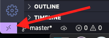
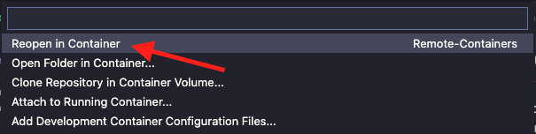

# My Dev Containers

These are dev containers I use at home and work. I would even install in virtual machines in the cloud if needed.

## Containers

1. Starship prompt - this container comes packed with the [Starship prompt](https://starship.rs/) and many other tools for working in the command line.

## Pre-requisites

- Install [VSCode](https://code.visualstudio.com/download)
- Install [Docker](https://docs.docker.com/get-docker/)
- Install VSCode [remote containers](https://code.visualstudio.com/docs/remote/containers) extension

## Installation

1. Open VSCode in the folder or workspace you'd like to install
2. Create a dot folder `.devcontainer`
3. In the `.devcontainer` folder create a `devcontainer.json`
4. Add the following snipet:

    ```json
    {
        "image": "sergioalen/starship-prompt",
    }
    ```
5. Click on the bottom left "Open a Remote Window" button:
   
    
6. Then click on the "Reopen in Container" option:
   
    